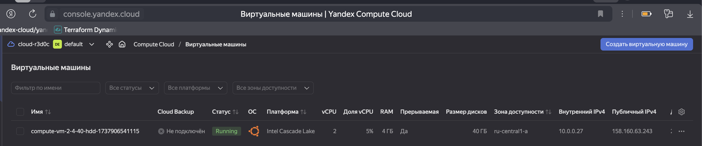
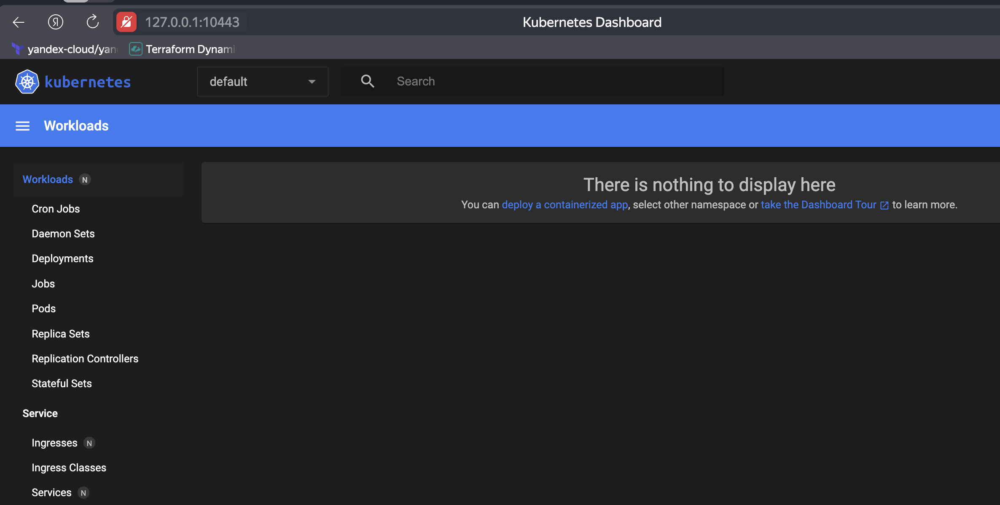

# Домашнее задание к занятию «Kubernetes. Причины появления. Команда kubectl»

### Цель задания

Для экспериментов и валидации ваших решений вам нужно подготовить тестовую среду для работы с Kubernetes. Оптимальное решение — развернуть на рабочей машине или на отдельной виртуальной машине MicroK8S.

------

### Чеклист готовности к домашнему заданию

1. Личный компьютер с ОС Linux или MacOS

или

2. ВМ c ОС Linux в облаке либо ВМ на локальной машине для установки MicroK8S  

------

### Инструкция к заданию

1. Установка MicroK8S:
    - sudo apt update,
    - sudo apt install snapd,
    - sudo snap install microk8s --classic,
    - добавить локального пользователя в группу `sudo usermod -a -G microk8s $USER`,
    - изменить права на папку с конфигурацией `sudo chown -f -R $USER ~/.kube`.

2. Полезные команды:
    - проверить статус `microk8s status --wait-ready`;
    - подключиться к microK8s и получить информацию можно через команду `microk8s command`, например, `microk8s kubectl get nodes`;
    - включить addon можно через команду `microk8s enable`; 
    - список addon `microk8s status`;
    - вывод конфигурации `microk8s config`;
    - проброс порта для подключения локально `microk8s kubectl port-forward -n kube-system service/kubernetes-dashboard 10443:443`.

3. Настройка внешнего подключения:
    - отредактировать файл /var/snap/microk8s/current/certs/csr.conf.template
    ```shell
    # [ alt_names ]
    # Add
    # IP.4 = 123.45.67.89
    ```
    - обновить сертификаты `sudo microk8s refresh-certs --cert front-proxy-client.crt`.

4. Установка kubectl:
    - curl -LO https://storage.googleapis.com/kubernetes-release/release/`curl -s https://storage.googleapis.com/kubernetes-release/release/stable.txt`/bin/linux/amd64/kubectl;
    - chmod +x ./kubectl;
    - sudo mv ./kubectl /usr/local/bin/kubectl;
    - настройка автодополнения в текущую сессию `bash source <(kubectl completion bash)`;
    - добавление автодополнения в командную оболочку bash `echo "source <(kubectl completion bash)" >> ~/.bashrc`.

------

### Инструменты и дополнительные материалы, которые пригодятся для выполнения задания

1. [Инструкция](https://microk8s.io/docs/getting-started) по установке MicroK8S.
2. [Инструкция](https://kubernetes.io/ru/docs/reference/kubectl/cheatsheet/#bash) по установке автодополнения **kubectl**.
3. [Шпаргалка](https://kubernetes.io/ru/docs/reference/kubectl/cheatsheet/) по **kubectl**.

------

### Задание 1. Установка MicroK8S

1. Установить MicroK8S на локальную машину или на удалённую виртуальную машину.
2. Установить dashboard.
3. Сгенерировать сертификат для подключения к внешнему ip-адресу.

#### Решение 

1. Задание:
    - Создаю ВМ
    

    - Устанавливаю MicroK8S

        ```bash
        alekseykashin@compute-vm-2-4-40-hdd-1737906541115:~$ sudo apt update
        Hit:1 http://archive.ubuntu.com/ubuntu noble InRelease
        ...
        Fetched 6,010 kB in 3s (2,089 kB/s)                               
        Reading package lists... Done
        Building dependency tree... Done
        Reading state information... Done
        35 packages can be upgraded. Run 'apt list --upgradable' to see them.
        alekseykashin@compute-vm-2-4-40-hdd-1737906541115:~$ sudo apt install snapd
        Reading package lists... Done
        Building dependency tree... Done
        Reading state information... Done
        snapd is already the newest version (2.66.1+24.04).
        snapd set to manually installed.
        0 upgraded, 0 newly installed, 0 to remove and 35 not upgraded.
        alekseykashin@compute-vm-2-4-40-hdd-1737906541115:~$ sudo snap install microk8s --classic
        2025-01-26T16:17:57Z INFO Waiting for automatic snapd restart...
        microk8s (1.31/stable) v1.31.5 from Canonical✓ installed
        alekseykashin@compute-vm-2-4-40-hdd-1737906541115:~$ sudo usermod -a -G microk8s $USER
        alekseykashin@compute-vm-2-4-40-hdd-1737906541115:~$ sudo chown -f -R $USER ~/.kube
        ```

    - Проверяем MicroK8S

        ```bash
        alekseykashin@compute-vm-2-4-40-hdd-1737906541115:~$ microk8s status
        microk8s is running
        high-availability: no
            datastore master nodes: 127.0.0.1:19001
            datastore standby nodes: none
        ```

    - Проверяем ноду

        ```bash
        alekseykashin@compute-vm-2-4-40-hdd-1737906541115:~$ microk8s kubectl get nodes
        NAME                                  STATUS   ROLES    AGE   VERSION
        compute-vm-2-4-40-hdd-1737906541115   Ready    <none>   47m   v1.31.5
        ```

    - Устанавливаем дашбоард

        ```bash
        alekseykashin@compute-vm-2-4-40-hdd-1737906541115:~$ microk8s enable dashboard
        Infer repository core for addon dashboard
        Enabling Kubernetes Dashboard
        Infer repository core for addon metrics-server
        Enabling Metrics-Server
        serviceaccount/metrics-server created
        clusterrole.rbac.authorization.k8s.io/system:aggregated-metrics-reader created
        clusterrole.rbac.authorization.k8s.io/system:metrics-server created
        rolebinding.rbac.authorization.k8s.io/metrics-server-auth-reader created
        clusterrolebinding.rbac.authorization.k8s.io/metrics-server:system:auth-delegator created
        clusterrolebinding.rbac.authorization.k8s.io/system:metrics-server created
        service/metrics-server created
        deployment.apps/metrics-server created
        apiservice.apiregistration.k8s.io/v1beta1.metrics.k8s.io created
        clusterrolebinding.rbac.authorization.k8s.io/microk8s-admin created
        Metrics-Server is enabled
        Applying manifest
        serviceaccount/kubernetes-dashboard created
        service/kubernetes-dashboard created
        secret/kubernetes-dashboard-certs created
        secret/kubernetes-dashboard-csrf created
        secret/kubernetes-dashboard-key-holder created
        configmap/kubernetes-dashboard-settings created
        role.rbac.authorization.k8s.io/kubernetes-dashboard created
        clusterrole.rbac.authorization.k8s.io/kubernetes-dashboard created
        rolebinding.rbac.authorization.k8s.io/kubernetes-dashboard created
        clusterrolebinding.rbac.authorization.k8s.io/kubernetes-dashboard created
        deployment.apps/kubernetes-dashboard created
        service/dashboard-metrics-scraper created
        deployment.apps/dashboard-metrics-scraper created
        secret/microk8s-dashboard-token created

        If RBAC is not enabled access the dashboard using the token retrieved with:

        microk8s kubectl describe secret -n kube-system microk8s-dashboard-token

        Use this token in the https login UI of the kubernetes-dashboard service.

        In an RBAC enabled setup (microk8s enable RBAC) you need to create a user with restricted
        permissions as shown in:
        https://github.com/kubernetes/dashboard/blob/master/docs/user/access-control/creating-sample-user.md

        alekseykashin@compute-vm-2-4-40-hdd-1737906541115:~$ microk8s kubectl describe secret -n kube-system microk8s-dashboard-token
        Name:         microk8s-dashboard-token
        Namespace:    kube-system
        Labels:       <none>
        Annotations:  kubernetes.io/service-account.name: default
                    kubernetes.io/service-account.uid: 1608ffed-29e8-4230-b9c2-03c3661ed147

        Type:  kubernetes.io/service-account-token

        Data
        ====
        namespace:  11 bytes
        token:      ***********************************************************
        ca.crt:     1123 bytes
        ```

    - Настраиваем внешнее подключение /var/snap/microk8s/current/certs/csr.conf.template, добавляем внешний ip

        ```conf
        [ req ]
        default_bits = 2048
        prompt = no
        default_md = sha256
        req_extensions = req_ext
        distinguished_name = dn

        [ dn ]
        C = GB
        ST = Canonical
        L = Canonical
        O = Canonical
        OU = Canonical
        CN = 127.0.0.1

        [ req_ext ]
        subjectAltName = @alt_names

        [ alt_names ]
        DNS.1 = kubernetes
        DNS.2 = kubernetes.default
        DNS.3 = kubernetes.default.svc
        DNS.4 = kubernetes.default.svc.cluster
        DNS.5 = kubernetes.default.svc.cluster.local
        IP.1 = 127.0.0.1
        IP.2 = 10.152.183.1
        IP.3 = 158.160.63.243
        #MOREIPS

        [ v3_ext ]
        authorityKeyIdentifier=keyid,issuer:always
        basicConstraints=CA:FALSE
        keyUsage=keyEncipherment,dataEncipherment,digitalSignature
        extendedKeyUsage=serverAuth,clientAuth
        subjectAltName=@alt_names
        ```

    - Обновляем сертификатры

        ```bash
        alekseykashin@compute-vm-2-4-40-hdd-1737906541115:~$ sudo microk8s refresh-certs --cert front-proxy-client.crt
        Taking a backup of the current certificates under /var/snap/microk8s/7592/certs-backup/
        Creating new certificates
        Signature ok
        subject=CN = front-proxy-client
        Getting CA Private Key
        Restarting service kubelite.
        ```

------

### Задание 2. Установка и настройка локального kubectl
1. Установить на локальную машину kubectl.
2. Настроить локально подключение к кластеру.
3. Подключиться к дашборду с помощью port-forward.

#### Решение

2. Задание
    - Утсанавливаем kubectl

        ```bash
        alekseykashin@Mac ~ % kubectl version --client
        Client Version: v1.30.5
        Kustomize Version: v5.0.4-0.20230601165947-6ce0bf390ce3
        ```

    - Добавляем конфиг в `~/.kube` и проверяем кластер и ноды

        ```bash
        alekseykashin@Mac ~ % kubectl cluster-info
        Kubernetes control plane is running at https://158.160.63.243:16443
        CoreDNS is running at https://158.160.63.243:16443/api/v1/namespaces/kube-system/services/kube-dns:dns/proxy

        To further debug and diagnose cluster problems, use 'kubectl cluster-info dump'.
        alekseykashin@Mac ~ % kubectl get nodes   
        NAME                                  STATUS   ROLES    AGE   VERSION
        compute-vm-2-4-40-hdd-1737906541115   Ready    <none>   91m   v1.31.5
        ```

    - Подключаемся к дашборду

        ```bash
        alekseykashin@Mac ~ % kubectl port-forward -n kube-system service/kubernetes-dashboard 10443:443 
        Forwarding from 127.0.0.1:10443 -> 8443
        Forwarding from [::1]:10443 -> 8443
        Handling connection for 10443
        Handling connection for 10443
        Handling connection for 10443
        ```

        

------

### Правила приёма работы

1. Домашняя работа оформляется в своём Git-репозитории в файле README.md. Выполненное домашнее задание пришлите ссылкой на .md-файл в вашем репозитории.
2. Файл README.md должен содержать скриншоты вывода команд `kubectl get nodes` и скриншот дашборда.

------

### Критерии оценки
Зачёт — выполнены все задания, ответы даны в развернутой форме, приложены соответствующие скриншоты и файлы проекта, в выполненных заданиях нет противоречий и нарушения логики.

На доработку — задание выполнено частично или не выполнено, в логике выполнения заданий есть противоречия, существенные недостатки.
