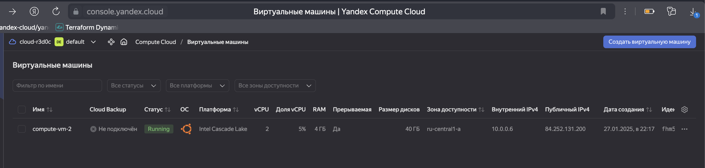

# Домашнее задание к занятию «Сетевое взаимодействие в K8S. Часть 1»

### Цель задания

В тестовой среде Kubernetes необходимо обеспечить доступ к приложению, установленному в предыдущем ДЗ и состоящему из двух контейнеров, по разным портам в разные контейнеры как внутри кластера, так и снаружи.

------

### Чеклист готовности к домашнему заданию

1. Установленное k8s-решение (например, MicroK8S).
2. Установленный локальный kubectl.
3. Редактор YAML-файлов с подключённым Git-репозиторием.

------

### Инструменты и дополнительные материалы, которые пригодятся для выполнения задания

1. [Описание](https://kubernetes.io/docs/concepts/workloads/controllers/deployment/) Deployment и примеры манифестов.
2. [Описание](https://kubernetes.io/docs/concepts/services-networking/service/) Описание Service.
3. [Описание](https://github.com/wbitt/Network-MultiTool) Multitool.

------

### Задание 1. Создать Deployment и обеспечить доступ к контейнерам приложения по разным портам из другого Pod внутри кластера

1. Создать Deployment приложения, состоящего из двух контейнеров (nginx и multitool), с количеством реплик 3 шт.
2. Создать Service, который обеспечит доступ внутри кластера до контейнеров приложения из п.1 по порту 9001 — nginx 80, по 9002 — multitool 8080.
3. Создать отдельный Pod с приложением multitool и убедиться с помощью `curl`, что из пода есть доступ до приложения из п.1 по разным портам в разные контейнеры.
4. Продемонстрировать доступ с помощью `curl` по доменному имени сервиса.
5. Предоставить манифесты Deployment и Service в решении, а также скриншоты или вывод команды п.4.

#### Решение

- Создаем Deplyment, состоящего из двух контейнеров (nginx и multitool) на порту nginx = 80 и multitool = 8080.

```yml
apiVersion: apps/v1
kind: Deployment
metadata:
  name: nginx-deployment
  labels:
    app: nginx
spec:
  replicas: 2
  selector:
    matchLabels:
      app: nginx
  template:
    metadata:
      labels:
        app: nginx
    spec:
      containers:
      - name: nginx
        image: nginx:latest
        ports:
        - containerPort: 80
      - name: multitool
        image: wbitt/network-multitool
        env:
        - name: HTTP_PORT
          value: "8080"
        ports:
        - containerPort: 8080
```

- Применяем Deplyment

```bash
alekseykashin@compute-vm-2:~$ sudo microk8s kubectl apply -f deploy.yml
deployment.apps/nginx-deployment created
alekseykashin@compute-vm-2:~$ sudo microk8s kubectl get po
NAME                                READY   STATUS    RESTARTS   AGE
nginx-deployment-7cdc889dc9-jbz4k   2/2     Running   0          8s
nginx-deployment-7cdc889dc9-r58sd   2/2     Running   0          8s
```

- Создаем Service ClusterIP MultiPort, который обеспечит доступ внутри кластера до контейнеров приложения из п.1 по порту 9001 — nginx порт 80, по 9002 — multitool порт 8080.

```yml
apiVersion: v1
kind: Service
metadata:
  name: nginx-svc
spec:
  selector:
    app: nginx
  ports:
  - name: nginx
    protocol: TCP
    port: 9001
    targetPort: 80
  - name: multitool
    protocol: TCP
    port: 9002
    targetPort: 8080
```

- Применяем Service

```bash
alekseykashin@compute-vm-2:~$ sudo microk8s kubectl apply -f service.yml
service/nginx-svc created
alekseykashin@compute-vm-2:~$ sudo microk8s kubectl get svc
NAME         TYPE        CLUSTER-IP       EXTERNAL-IP   PORT(S)           AGE
kubernetes   ClusterIP   10.152.183.1     <none>        443/TCP           2d
nginx-svc    ClusterIP   10.152.183.224   <none>        80/TCP,8080/TCP   15s
```

- Создаем Pod, для проверки доступа к контейнерам.  

```yml
apiVersion: v1
kind: Pod
metadata:
  name: multitool
spec:
  containers:
  - name: network-multitool
    image: wbitt/network-multitool
```

- Применяем Pod

```bash
alekseykashin@compute-vm-2:~$ sudo microk8s kubectl apply -f multitool.yml
pod/multitool created
alekseykashin@compute-vm-2:~$ sudo microk8s kubectl get po
NAME                                READY   STATUS    RESTARTS   AGE
multitool                           1/1     Running   0          6s
nginx-deployment-7cdc889dc9-jbz4k   2/2     Running   0          25m
nginx-deployment-7cdc889dc9-r58sd   2/2     Running   0          25m
alekseykashin@compute-vm-2:~$ 
```

- Проверяем доступ к контейнеру NGINX

```bash
alekseykashin@compute-vm-2:~$ microk8s kubectl exec multitool -- curl nginx-svc:9001
  % Total    % Received % Xferd  Average Speed   Time    Time     Time  Current
                                 Dload  Upload   Total   Spent    Left  Speed
  0     0    0     0    0     0      0      0 --:--:-- --:--:-- --:--:--     0<!DOCTYPE html>
<html>
<head>
<title>Welcome to nginx!</title>
<style>
html { color-scheme: light dark; }
body { width: 35em; margin: 0 auto;
font-family: Tahoma, Verdana, Arial, sans-serif; }
</style>
</head>
<body>
<h1>Welcome to nginx!</h1>
<p>If you see this page, the nginx web server is successfully installed and
working. Further configuration is required.</p>

<p>For online documentation and support please refer to
<a href="http://nginx.org/">nginx.org</a>.<br/>
Commercial support is available at
<a href="http://nginx.com/">nginx.com</a>.</p>

<p><em>Thank you for using nginx.</em></p>
</body>
</html>
100   615  100   615    0     0  14918      0 --:--:-- --:--:-- --:--:-- 15000
```

- Проверяем доступ к контейнеру Multitool

```yml
alekseykashin@compute-vm-2:~$ microk8s kubectl exec multitool -- curl nginx-svc:9002
  % Total    % Received % Xferd  Average Speed   Time    Time     Time  Current
                                 Dload  Upload   Total   Spent    Left  Speed
100   150  100   150    0     0  82644      0 --:--:-- --:--:-- --:--:--  146k
WBITT Network MultiTool (with NGINX) - nginx-deployment-7cdc889dc9-jbz4k - 10.1.44.36 - HTTP: 8080 , HTTPS: 443 . (Formerly praqma/network-multitool)
alekseykashin@compute-vm-2:~$ 
```

------

### Задание 2. Создать Service и обеспечить доступ к приложениям снаружи кластера

1. Создать отдельный Service приложения из Задания 1 с возможностью доступа снаружи кластера к nginx, используя тип NodePort.
2. Продемонстрировать доступ с помощью браузера или `curl` с локального компьютера.
3. Предоставить манифест и Service в решении, а также скриншоты или вывод команды п.2.


- Берем Deployment из п.1
- Создаем Service NodePort

```yml
apiVersion: v1
kind: Service
metadata:
  name: nginx-svc
spec:
  selector:
    app: nginx
  type: NodePort
  ports:
  - name: nginx
    protocol: TCP
    port: 9001
    targetPort: 80
    nodePort: 30001
  - name: multitool
    protocol: TCP
    port: 9002
    targetPort: 8080
    nodePort: 30002
```

- Применяем Service

```bash
alekseykashin@compute-vm-2:~$ sudo microk8s kubectl apply -f Service_NodePort.yml
service/nginx-svc created
alekseykashin@compute-vm-2:~$ sudo microk8s kubectl get svc
NAME         TYPE        CLUSTER-IP       EXTERNAL-IP   PORT(S)                         AGE
kubernetes   ClusterIP   10.152.183.1     <none>        443/TCP                         2d
nginx-svc    NodePort    10.152.183.211   <none>        9001:30001/TCP,9002:30002/TCP   5s
alekseykashin@compute-vm-2:~$ 
```

- Машина в облаке



- На локальной машине проверяем доступ к контейнеру Nginx по порту 30002


```bash
alekseykashin@Mac ~ % curl 84.252.131.200:30001 
<!DOCTYPE html>
<html>
<head>
<title>Welcome to nginx!</title>
<style>
html { color-scheme: light dark; }
body { width: 35em; margin: 0 auto;
font-family: Tahoma, Verdana, Arial, sans-serif; }
</style>
</head>
<body>
<h1>Welcome to nginx!</h1>
<p>If you see this page, the nginx web server is successfully installed and
working. Further configuration is required.</p>

<p>For online documentation and support please refer to
<a href="http://nginx.org/">nginx.org</a>.<br/>
Commercial support is available at
<a href="http://nginx.com/">nginx.com</a>.</p>

<p><em>Thank you for using nginx.</em></p>
</body>
</html>

```

- На локальной машине проверяем доступ к контейнеру Multitool по порту 30002

```bash
alekseykashin@Mac ~ % curl 84.252.131.200:30002 
WBITT Network MultiTool (with NGINX) - nginx-deployment-7cdc889dc9-jhcwb - 10.1.44.40 - HTTP: 8080 , HTTPS: 443 . (Formerly praqma/network-multitool)
alekseykashin@Mac ~ % 
```

------

### Правила приёма работы

1. Домашняя работа оформляется в своем Git-репозитории в файле README.md. Выполненное домашнее задание пришлите ссылкой на .md-файл в вашем репозитории.
2. Файл README.md должен содержать скриншоты вывода необходимых команд `kubectl` и скриншоты результатов.
3. Репозиторий должен содержать тексты манифестов или ссылки на них в файле README.md.

