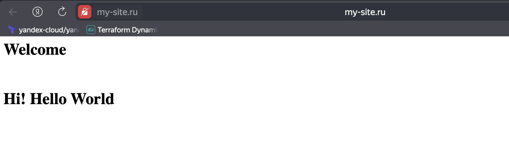
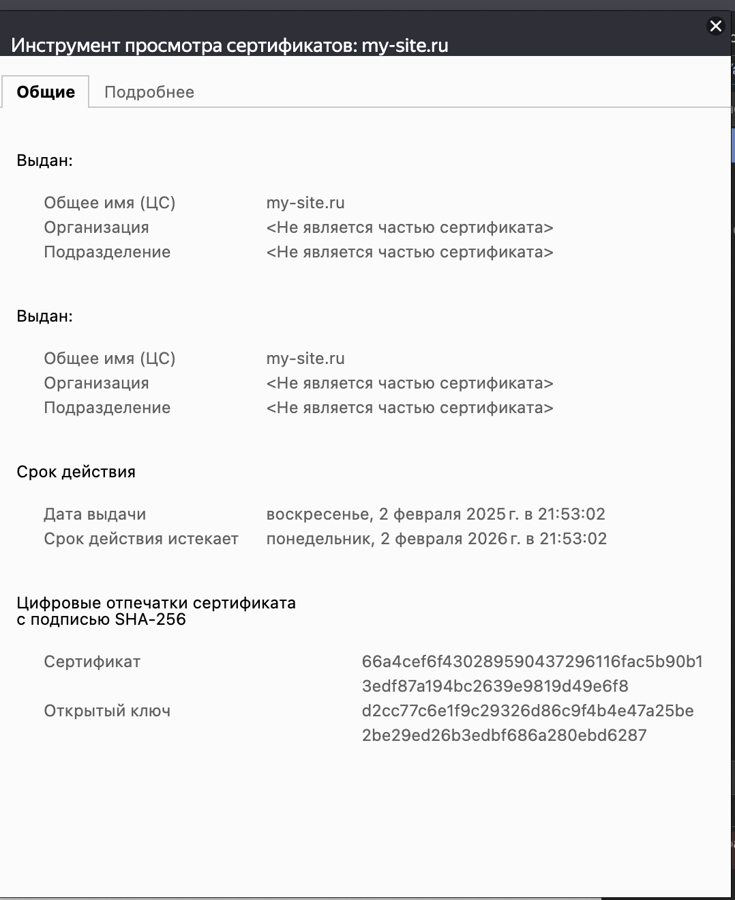

# Домашнее задание к занятию «Конфигурация приложений»

### Цель задания

В тестовой среде Kubernetes необходимо создать конфигурацию и продемонстрировать работу приложения.

------

### Чеклист готовности к домашнему заданию

1. Установленное K8s-решение (например, MicroK8s).
2. Установленный локальный kubectl.
3. Редактор YAML-файлов с подключённым GitHub-репозиторием.

------

### Инструменты и дополнительные материалы, которые пригодятся для выполнения задания

1. [Описание](https://kubernetes.io/docs/concepts/configuration/secret/) Secret.
2. [Описание](https://kubernetes.io/docs/concepts/configuration/configmap/) ConfigMap.
3. [Описание](https://github.com/wbitt/Network-MultiTool) Multitool.

------

### Задание 1. Создать Deployment приложения и решить возникшую проблему с помощью ConfigMap. Добавить веб-страницу

1. Создать Deployment приложения, состоящего из контейнеров nginx и multitool.
2. Решить возникшую проблему с помощью ConfigMap.
3. Продемонстрировать, что pod стартовал и оба конейнера работают.
4. Сделать простую веб-страницу и подключить её к Nginx с помощью ConfigMap. Подключить Service и показать вывод curl или в браузере.
5. Предоставить манифесты, а также скриншоты или вывод необходимых команд.

#### Решение

- Создаю `ConfigMap` для `multitool`, который будет в себе содержать порт `1180` который мы будем считывать/наследовать `Deployment` объектом

```yml
apiVersion: v1
kind: ConfigMap
metadata:
  name: my-config-multitool
data:
  nginx.http.port: "1180"
```

- Создаю `ConfigMap` для `nginx`, который будет в себе содержать стратовую страничку `nginx` которую мы будем считывать/наследовать `Deployment` объектом

```yml
apiVersion: v1
kind: ConfigMap
metadata:
  name: my-config-nginx
data:
  index.html: |
    <html>
    <h1>Welcome</h1>
    </br>
    <h1>Hi! Hello World </h1>
    </html
```

- Создаю манифест `Deployment` в котором пропишем связки конфигов с контейнерами 

```yml
apiVersion: apps/v1
kind: Deployment
metadata:
  name: my-deployment
  labels:
    app: nginx
spec:
  replicas: 1
  selector:
    matchLabels:
      app: nginx
  template:
    metadata:
      labels:
        app: nginx
    spec:
      containers:
      - name: nginx
        image: nginx:latest
        ports:
        - containerPort: 80
        volumeMounts:
        - name: nginx-config-volume
          mountPath: /usr/share/nginx/html
      - name: network-multitool
        image: wbitt/network-multitool
        env:
        - name: HTTP_PORT
          valueFrom:
            configMapKeyRef:
              name: my-config-multitool
              key: nginx.http.port
        ports:
        - containerPort: 1180
      volumes:
      - name: nginx-config-volume
        configMap:
          name: my-config-nginx
```

- Применяем `ConfigMap` и `Deployment`

```bash
alekseykashin@Mac 2.3 % kubectl apply -f task1_mult_conf.yml 
configmap/my-config-multitool created
alekseykashin@Mac 2.3 % kubectl describe configmaps my-config-multitool 
Name:         my-config-multitool
Namespace:    default
Labels:       <none>
Annotations:  <none>

Data
====
nginx.http.port:
----
1180


BinaryData
====

Events:  <none>
```

```bash
alekseykashin@Mac 2.3 % kubectl apply -f task1_nginx_conf.yml          
configmap/my-config-nginx created
alekseykashin@Mac 2.3 % kubectl describe configmaps my-config-nginx    
Name:         my-config-nginx
Namespace:    default
Labels:       <none>
Annotations:  <none>

Data
====
index.html:
----
<html>
<h1>Welcome</h1>
</br>
<h1>Hi! Hello World </h1>
</html


BinaryData
====

Events:  <none>
```

- Убеждаемся что после запуска порт `Port: 1180/TCP` контейнера `network-multitool`, env = `HTTP_PORT:  <set to the key 'nginx.http.port' of config map 'my-config-multitool'>`
- Убеждаемся что ресурс был добавлен `Mounts: /usr/share/nginx/html from nginx-config-volume (rw)`

```bash
alekseykashin@Mac 2.3 % kubectl apply -f task1_dep.yml             
deployment.apps/my-deployment configured
alekseykashin@Mac 2.3 % kubectl get po                                 
NAME                             READY   STATUS    RESTARTS   AGE
my-deployment-6d8cf9f74c-6qsxh   2/2     Running   0          8s
alekseykashin@Mac 2.3 % kubectl describe po my-deployment-6d8cf9f74c-6qsxh 
Name:             my-deployment-6d8cf9f74c-6qsxh
Namespace:        default
Priority:         0
Service Account:  default
Node:             compute-vm-2/10.0.0.6
Start Time:       Sun, 02 Feb 2025 21:07:03 +0300
Labels:           app=nginx
                  pod-template-hash=6d8cf9f74c
Annotations:      cni.projectcalico.org/containerID: 38af3bde9fdc9652c36841badb4a73ebd6f4c3a07a1b0c5a2d770feb4e462624
                  cni.projectcalico.org/podIP: 10.1.44.31/32
                  cni.projectcalico.org/podIPs: 10.1.44.31/32
Status:           Running
IP:               10.1.44.31
IPs:
  IP:           10.1.44.31
Controlled By:  ReplicaSet/my-deployment-6d8cf9f74c
Containers:
  nginx:
    Container ID:   containerd://2bb14b5e66e832dbe00712e363dd13ade13094dc0cdff8528184f2b9b59a6546
    Image:          nginx:latest
    Image ID:       docker.io/library/nginx@sha256:0a399eb16751829e1af26fea27b20c3ec28d7ab1fb72182879dcae1cca21206a
    Port:           80/TCP
    Host Port:      0/TCP
    State:          Running
      Started:      Sun, 02 Feb 2025 21:07:07 +0300
    Ready:          True
    Restart Count:  0
    Environment:    <none>
    Mounts:
      /usr/share/nginx/html from nginx-config-volume (rw)
      /var/run/secrets/kubernetes.io/serviceaccount from kube-api-access-jznzb (ro)
  network-multitool:
    Container ID:   containerd://a4e559c9f7bd95dd8843108a91a1ec364626dec05d757c48be57937781b0358b
    Image:          wbitt/network-multitool
    Image ID:       docker.io/wbitt/network-multitool@sha256:d1137e87af76ee15cd0b3d4c7e2fcd111ffbd510ccd0af076fc98dddfc50a735
    Port:           1180/TCP
    Host Port:      0/TCP
    State:          Running
      Started:      Sun, 02 Feb 2025 21:07:08 +0300
    Ready:          True
    Restart Count:  0
    Environment:
      HTTP_PORT:  <set to the key 'nginx.http.port' of config map 'my-config-multitool'>  Optional: false
    Mounts:
      /var/run/secrets/kubernetes.io/serviceaccount from kube-api-access-jznzb (ro)
Conditions:
  Type                        Status
  PodReadyToStartContainers   True 
  Initialized                 True 
  Ready                       True 
  ContainersReady             True 
  PodScheduled                True 
Volumes:
  nginx-config-volume:
    Type:      ConfigMap (a volume populated by a ConfigMap)
    Name:      my-config-nginx
    Optional:  false
  kube-api-access-jznzb:
    Type:                    Projected (a volume that contains injected data from multiple sources)
    TokenExpirationSeconds:  3607
    ConfigMapName:           kube-root-ca.crt
    ConfigMapOptional:       <nil>
    DownwardAPI:             true
QoS Class:                   BestEffort
Node-Selectors:              <none>
Tolerations:                 node.kubernetes.io/not-ready:NoExecute op=Exists for 300s
                             node.kubernetes.io/unreachable:NoExecute op=Exists for 300s
Events:
  Type    Reason     Age   From               Message
  ----    ------     ----  ----               -------
  Normal  Scheduled  31s   default-scheduler  Successfully assigned default/my-deployment-6d8cf9f74c-6qsxh to compute-vm-2
  Normal  Pulling    31s   kubelet            Pulling image "nginx:latest"
  Normal  Pulled     28s   kubelet            Successfully pulled image "nginx:latest" in 3.081s (3.081s including waiting). Image size: 72080558 bytes.
  Normal  Created    27s   kubelet            Created container nginx
  Normal  Started    27s   kubelet            Started container nginx
  Normal  Pulling    27s   kubelet            Pulling image "wbitt/network-multitool"
  Normal  Pulled     26s   kubelet            Successfully pulled image "wbitt/network-multitool" in 1.281s (1.281s including waiting). Image size: 25281012 bytes.
  Normal  Created    26s   kubelet            Created container network-multitool
  Normal  Started    26s   kubelet            Started container network-multitool
alekseykashin@Mac 2.3 % 

```

- Проверяем на контейнере `nginx` наличие файла index.html

```bash
alekseykashin@Mac 2.3 % kubectl exec -it my-deployment-6d8cf9f74c-6qsxh -c nginx -- sh 
# cd /usr/share/nginx/html
# ls
index.html
# cat index.html
<html>
<h1>Welcome</h1>
</br>
<h1>Hi! Hello World </h1>
</html
# 
```

- Создаем `Service`, показываем нашу отнаследованную кастомную страничку из `ConfigMap`

```yml
apiVersion: v1
kind: Service
metadata:
  name: my-svc
spec:
  selector:
    app: nginx
  ports:
  - name: nginx
    protocol: TCP
    port: 9001
    targetPort: 80
  - name: multitool
    protocol: TCP
    port: 9002
    targetPort: 1180
```

- Стартовая страница `nginx`

```bash
alekseykashin@Mac 2.3 % kubectl apply -f task1_svc.yml 
service/my-svc created
alekseykashin@Mac 2.3 % kubectl get svc                                               
NAME         TYPE        CLUSTER-IP      EXTERNAL-IP   PORT(S)             AGE
kubernetes   ClusterIP   10.152.183.1    <none>        443/TCP             5d23h
my-svc       ClusterIP   10.152.183.99   <none>        9001/TCP,9002/TCP   7s
alekseykashin@Mac 2.3 % kubectl exec -it multitool -- bash                                
multitool:/# curl 10.152.183.99:9001
<html>
<h1>Welcome</h1>
</br>
<h1>Hi! Hello World </h1>
</html
```

------

### Задание 2. Создать приложение с вашей веб-страницей, доступной по HTTPS 

1. Создать Deployment приложения, состоящего из Nginx.
2. Создать собственную веб-страницу и подключить её как ConfigMap к приложению.
3. Выпустить самоподписной сертификат SSL. Создать Secret для использования сертификата.
4. Создать Ingress и необходимый Service, подключить к нему SSL в вид. Продемонстировать доступ к приложению по HTTPS. 
4. Предоставить манифесты, а также скриншоты или вывод необходимых команд.


#### Решение

- Создаем сертификатор и закрытый ключ [`nginx.crt` | `nginx.key`]

```
alekseykashin@compute-vm-2:~$ openssl req -x509 -days 365 -newkey rsa:2048 -sha256 -nodes -keyout nginx.key -out nginx.crt -subj "/CN=my-site.ru"
.......+......+....+....................+....+...+...+..+++++++++++++++++++++++++++++++++++++++++++++++++++++++++++++++++*.......+....+...+...+...+.....+.......+.....+.........+...+++++++++++++++++++++++++++++++++++++++++++++++++++++++++++++++++*.+............+............+..+.........+.+.......................+.......+.....+...+...+.......+...+..+............+.+..+.+.....+......+.+........+....+..+...............+....+.................+....+.........+..+.......+...+++++++++++++++++++++++++++++++++++++++++++++++++++++++++++++++++
.+......+.+.........+..+...+......+.+..+++++++++++++++++++++++++++++++++++++++++++++++++++++++++++++++++*..+....+...+..+...+....+.....+++++++++++++++++++++++++++++++++++++++++++++++++++++++++++++++++*........+....+............+...+..+......+...+.......+...+..+........................+++++++++++++++++++++++++++++++++++++++++++++++++++++++++++++++++
-----
```

- Создаем секрет `my-tls-secret`

```bash
alekseykashin@compute-vm-2:~$ microk8s kubectl create secret tls my-tls-secret --cert=nginx.crt --key=nginx.key
secret/my-tls-secret created
alekseykashin@compute-vm-2:~$ microk8s kubectl describe secrets my-tls-secret
Name:         my-tls-secret
Namespace:    default
Labels:       <none>
Annotations:  <none>

Type:  kubernetes.io/tls

Data
====
tls.crt:  1115 bytes
tls.key:  1704 bytes
```

- Применяем `Deployment`, `ConfigMap` взял из прошлого задания

```yml
apiVersion: apps/v1
kind: Deployment
metadata:
  name: my-deployment
  labels:
    app: nginx
spec:
  replicas: 1
  selector:
    matchLabels:
      app: nginx
  template:
    metadata:
      labels:
        app: nginx
    spec:
      containers:
      - name: nginx
        image: nginx:latest
        ports:
        - containerPort: 80
        volumeMounts:
        - name: nginx-config-volume
          mountPath: /usr/share/nginx/html
      volumes:
      - name: nginx-config-volume
        configMap:
          name: my-config-nginx
```

```bash
alekseykashin@Mac 2.3 % kubectl apply -f task2_dep.yml 
deployment.apps/my-deployment created
alekseykashin@Mac 2.3 % kubectl get po                
NAME                             READY   STATUS              RESTARTS   AGE
multitool                        1/1     Running             0          62m
my-deployment-569cb6856f-ppzmp   0/1     ContainerCreating   0          2s
alekseykashin@Mac 2.3 % kubectl get po
NAME                             READY   STATUS    RESTARTS   AGE
multitool                        1/1     Running   0          62m
my-deployment-569cb6856f-ppzmp   1/1     Running   0          7s
alekseykashin@Mac 2.3 % 
```

- Применяем `Service`

```yaml
apiVersion: v1
kind: Service
metadata:
  name: my-svc
spec:
  selector:
    app: nginx
  ports:
  - name: nginx
    protocol: TCP
    port: 80
    targetPort: 80
```

```bash
alekseykashin@Mac 2.3 % kubectl apply -f task2_svc.yml
service/my-svc created
alekseykashin@Mac 2.3 % kubectl get svc               
NAME         TYPE        CLUSTER-IP       EXTERNAL-IP   PORT(S)   AGE
kubernetes   ClusterIP   10.152.183.1     <none>        443/TCP   6d
my-svc       ClusterIP   10.152.183.226   <none>        80/TCP    2s
alekseykashin@Mac 2.3 % kubectl describe svc my-svc
Name:                     my-svc
Namespace:                default
Labels:                   <none>
Annotations:              <none>
Selector:                 app=nginx
Type:                     ClusterIP
IP Family Policy:         SingleStack
IP Families:              IPv4
IP:                       10.152.183.226
IPs:                      10.152.183.226
Port:                     nginx  80/TCP
TargetPort:               80/TCP
Endpoints:                10.1.44.34:80
Session Affinity:         None
Internal Traffic Policy:  Cluster
Events:                   <none>
alekseykashin@Mac 2.3 
```

- Применяем `Ingress`, добавляет секрет `my-tls-secret`, перенаправляем запросы на порт 443

```yaml
apiVersion: networking.k8s.io/v1
kind: Ingress
metadata:
  name: my-ingress
  annotations:
    nginx.ingress.kubernetes.io/rewrite-target: /
    nginx.ingress.kubernetes.io/ssl-redirect: "true"  # Перенаправлять HTTP на HTTPS
spec:
  ingressClassName: nginx
  tls:
  - hosts:
    - my-site.ru
    secretName: my-tls-secret
  rules:
  - host: my-site.ru
    http:
      paths:
      - path: /
        pathType: Prefix
        backend:
          service:
            name: my-svc
            port:
              number: 80
```

```bash
alekseykashin@Mac 2.3 % kubectl apply -f task2_ingress.yml 
ingress.networking.k8s.io/my-ingress created
alekseykashin@Mac 2.3 % kubectl get ingress               
NAME         CLASS   HOSTS        ADDRESS   PORTS     AGE
my-ingress   nginx   my-site.ru             80, 443   9s
alekseykashin@Mac 2.3 % kubectl describe ingress my-ingress 
Name:             my-ingress
Labels:           <none>
Namespace:        default
Address:          
Ingress Class:    nginx
Default backend:  <default>
TLS:
  my-tls-secret terminates my-site.ru
Rules:
  Host        Path  Backends
  ----        ----  --------
  my-site.ru  
              /   my-svc:80 (10.1.44.34:80)
Annotations:  nginx.ingress.kubernetes.io/rewrite-target: /
              nginx.ingress.kubernetes.io/ssl-redirect: true
Events:
  Type    Reason  Age   From                      Message
  ----    ------  ----  ----                      -------
  Normal  Sync    17s   nginx-ingress-controller  Scheduled for sync
alekseykashin@Mac 2.3 % 
```

- Провереяем доступ до хоста через 443 порт на локальной машине

```
alekseykashin@Mac 2.3 % curl https://my-site.ru/ -k
<html>
<h1>Welcome</h1>
</br>
<h1>Hi! Hello World </h1>
</html
alekseykashin@Mac 2.3 % 
```



- Проверяем сертификат



------

### Правила приёма работы

1. Домашняя работа оформляется в своём GitHub-репозитории в файле README.md. Выполненное домашнее задание пришлите ссылкой на .md-файл в вашем репозитории.
2. Файл README.md должен содержать скриншоты вывода необходимых команд `kubectl`, а также скриншоты результатов.
3. Репозиторий должен содержать тексты манифестов или ссылки на них в файле README.md.

------
