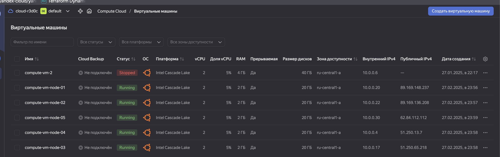

# Домашнее задание к занятию «Установка Kubernetes»

### Цель задания

Установить кластер K8s.

### Чеклист готовности к домашнему заданию

1. Развёрнутые ВМ с ОС Ubuntu 20.04-lts.


### Инструменты и дополнительные материалы, которые пригодятся для выполнения задания

1. [Инструкция по установке kubeadm](https://kubernetes.io/docs/setup/production-environment/tools/kubeadm/create-cluster-kubeadm/).
2. [Документация kubespray](https://kubespray.io/).

-----

### Задание 1. Установить кластер k8s с 1 master node

1. Подготовка работы кластера из 5 нод: 1 мастер и 4 рабочие ноды.
2. В качестве CRI — containerd.
3. Запуск etcd производить на мастере.
4. Способ установки выбрать самостоятельно.

#### Решение 

Подготоваливаем 5 нод:




- Обновляем пакеты

```bash
alekseykashin@compute-vm-node-01:~$ sudo apt update && sudo apt upgrade -y
Hit:1 http://mirror.yandex.ru/ubuntu noble InRelease
Hit:2 http://mirror.yandex.ru/ubuntu noble-updates InRelease                 
Hit:3 http://mirror.yandex.ru/ubuntu noble-backports InRelease               
Hit:4 http://security.ubuntu.com/ubuntu noble-security InRelease             
Reading package lists... Done                          
Building dependency tree... Done
Reading state information... Done
31 packages can be upgraded. Run 'apt
```

- Настраиваем сетевые параметры 

```bash
cat <<EOF | sudo tee /etc/modules-load.d/k8s.conf
overlay
br_netfilter
EOF

sudo modprobe overlay
sudo modprobe br_netfilter

cat <<EOF | sudo tee /etc/sysctl.d/k8s.conf
net.bridge.bridge-nf-call-iptables  = 1
net.bridge.bridge-nf-call-ip6tables = 1
net.ipv4.ip_forward                 = 1
EOF

sudo sysctl --system
```

- Устанавливаем containerd

```bash
alekseykashin@compute-vm-node-01:~$ sudo apt install -y containerd
Reading package lists... Done
Building dependency tree... Done
Reading state information... Done
```


- Добавляем репозиторий Kubernetes

```bash
alekseykashin@compute-vm-node-01:~$ sudo apt install -y apt-transport-https curl
curl -fsSL https://pkgs.k8s.io/core:/stable:/v1.30/deb/Release.key | sudo gpg --dearmor -o /etc/apt/keyrings/kubernetes-apt-keyring.gpg
echo 'deb [signed-by=/etc/apt/keyrings/kubernetes-apt-keyring.gpg] https://pkgs.k8s.io/core:/stable:/v1.30/deb/ /' | sudo tee /etc/apt/sources.list.d/kubernetes.list
sudo apt update
Reading package lists... Done
Building dependency tree... Done
Reading state information... Done
curl is already the newest version (8.5.0-2ubuntu10.6).
curl set to manually installed.
```

- Установливаем пакеты

```bash
alekseykashin@compute-vm-node-01:~$ sudo apt install -y kubelet kubeadm kubectl
Reading package lists... Done
Building dependency tree... Done
Reading state information... Done
```

- Фиксируем версию

```bash
alekseykashin@compute-vm-node-01:~$ sudo apt-mark hold kubelet kubeadm kubectl  # запрет автообновления
kubelet set on hold.
kubeadm set on hold.
kubectl set on hold.
```

- Запускаем инициализацию

```bash
alekseykashin@compute-vm-node-01:~$ sudo kubeadm init --pod-network-cidr=10.244.0.0/16 
I0227 21:45:57.172814   17353 version.go:256] remote version is much newer: v1.32.2; falling back to: stable-1.30
[init] Using Kubernetes version: v1.30.10
[preflight] Running pre-flight checks
[preflight] Pulling images required for setting up a Kubernetes cluster
[preflight] This might take a minute or two, depending on the speed of your internet connection
[preflight] You can also perform this action in beforehand using 'kubeadm config images pull'
W0227 21:45:57.954108   17353 checks.go:844] detected that the sandbox image "registry.k8s.io/pause:3.8" of the container runtime is inconsistent with that used by kubeadm.It is recommended to use "registry.k8s.io/pause:3.9" as the CRI sandbox image.
[certs] Using certificateDir folder "/etc/kubernetes/pki"
[certs] Generating "ca" certificate and key
[certs] Generating "apiserver" certificate and key
[certs] apiserver serving cert is signed for DNS names [compute-vm-node-01 kubernetes kubernetes.default kubernetes.default.svc kubernetes.default.svc.cluster.local] and IPs [10.96.0.1 10.0.0.20]
[certs] Generating "apiserver-kubelet-client" certificate and key
[certs] Generating "front-proxy-ca" certificate and key
[certs] Generating "front-proxy-client" certificate and key
[certs] Generating "etcd/ca" certificate and key
[certs] Generating "etcd/server" certificate and key
[certs] etcd/server serving cert is signed for DNS names [compute-vm-node-01 localhost] and IPs [10.0.0.20 127.0.0.1 ::1]
[certs] Generating "etcd/peer" certificate and key
[certs] etcd/peer serving cert is signed for DNS names [compute-vm-node-01 localhost] and IPs [10.0.0.20 127.0.0.1 ::1]
[certs] Generating "etcd/healthcheck-client" certificate and key
[certs] Generating "apiserver-etcd-client" certificate and key
[certs] Generating "sa" key and public key
[kubeconfig] Using kubeconfig folder "/etc/kubernetes"
[kubeconfig] Writing "admin.conf" kubeconfig file
[kubeconfig] Writing "super-admin.conf" kubeconfig file
[kubeconfig] Writing "kubelet.conf" kubeconfig file
[kubeconfig] Writing "controller-manager.conf" kubeconfig file
[kubeconfig] Writing "scheduler.conf" kubeconfig file
[etcd] Creating static Pod manifest for local etcd in "/etc/kubernetes/manifests"
[control-plane] Using manifest folder "/etc/kubernetes/manifests"
[control-plane] Creating static Pod manifest for "kube-apiserver"
[control-plane] Creating static Pod manifest for "kube-controller-manager"
[control-plane] Creating static Pod manifest for "kube-scheduler"
[kubelet-start] Writing kubelet environment file with flags to file "/var/lib/kubelet/kubeadm-flags.env"
[kubelet-start] Writing kubelet configuration to file "/var/lib/kubelet/config.yaml"
[kubelet-start] Starting the kubelet
[wait-control-plane] Waiting for the kubelet to boot up the control plane as static Pods from directory "/etc/kubernetes/manifests"
[kubelet-check] Waiting for a healthy kubelet at http://127.0.0.1:10248/healthz. This can take up to 4m0s
[kubelet-check] The kubelet is healthy after 503.567795ms
[api-check] Waiting for a healthy API server. This can take up to 4m0s
[api-check] The API server is healthy after 8.502022879s
[upload-config] Storing the configuration used in ConfigMap "kubeadm-config" in the "kube-system" Namespace
[kubelet] Creating a ConfigMap "kubelet-config" in namespace kube-system with the configuration for the kubelets in the cluster
[upload-certs] Skipping phase. Please see --upload-certs
[mark-control-plane] Marking the node compute-vm-node-01 as control-plane by adding the labels: [node-role.kubernetes.io/control-plane node.kubernetes.io/exclude-from-external-load-balancers]
[mark-control-plane] Marking the node compute-vm-node-01 as control-plane by adding the taints [node-role.kubernetes.io/control-plane:NoSchedule]
[bootstrap-token] Using token: 06t11c.v77x4zmv4p9mccfv
[bootstrap-token] Configuring bootstrap tokens, cluster-info ConfigMap, RBAC Roles
[bootstrap-token] Configured RBAC rules to allow Node Bootstrap tokens to get nodes
[bootstrap-token] Configured RBAC rules to allow Node Bootstrap tokens to post CSRs in order for nodes to get long term certificate credentials
[bootstrap-token] Configured RBAC rules to allow the csrapprover controller automatically approve CSRs from a Node Bootstrap Token
[bootstrap-token] Configured RBAC rules to allow certificate rotation for all node client certificates in the cluster
[bootstrap-token] Creating the "cluster-info" ConfigMap in the "kube-public" namespace
[kubelet-finalize] Updating "/etc/kubernetes/kubelet.conf" to point to a rotatable kubelet client certificate and key
[addons] Applied essential addon: CoreDNS
[addons] Applied essential addon: kube-proxy

Your Kubernetes control-plane has initialized successfully!

To start using your cluster, you need to run the following as a regular user:

  mkdir -p $HOME/.kube
  sudo cp -i /etc/kubernetes/admin.conf $HOME/.kube/config
  sudo chown $(id -u):$(id -g) $HOME/.kube/config

Alternatively, if you are the root user, you can run:

  export KUBECONFIG=/etc/kubernetes/admin.conf

You should now deploy a pod network to the cluster.
Run "kubectl apply -f [podnetwork].yaml" with one of the options listed at:
  https://kubernetes.io/docs/concepts/cluster-administration/addons/

Then you can join any number of worker nodes by running the following on each as root:

kubeadm join 10.0.0.20:6443 --token 06t11c.v77x4zmv4p9mccfv \
	--discovery-token-ca-cert-hash sha256:1dfb8ee65751d079a482c07720140f15e0c4b97cdc31d683914a395185808e55 
alekseykashin@compute-vm-node-01:~$ 
```

- Настраиваем подключение

```bash
alekseykashin@compute-vm-node-01:~$ mkdir -p $HOME/.kube
sudo cp -i /etc/kubernetes/admin.conf $HOME/.kube/config
sudo chown $(id -u):$(id -g) $HOME/.kube/config
```

- Проверяем подключение

```bash
alekseykashin@compute-vm-node-01:~$ kubectl get nodes
NAME                 STATUS     ROLES           AGE    VERSION
compute-vm-node-01   NotReady   control-plane   116s   v1.30.10
```


- Накаждой work ноде проделываем предыдущие шаги, подключаем каждую ноду к мастер ноде

```bash
alekseykashin@compute-vm-node-0*:~$ kubeadm join 10.0.0.20:6443 --token 06t11c.v77x4zmv4p9mccfv \
        --discovery-token-ca-cert-hash sha256:1dfb8ee65751d079a482c07720140f15e0c4b97cdc31d683914a395185808e55
```

- Проверяем количество нод

```bash
alekseykashin@compute-vm-node-01:~$ kubectl get nodes
NAME                 STATUS     ROLES           AGE     VERSION
compute-vm-node-01   NotReady   control-plane   21m     v1.30.10
compute-vm-node-02   NotReady   <none>          5m38s   v1.30.10
compute-vm-node-03   NotReady   <none>          4s      v1.28.15
compute-vm-node-04   NotReady   <none>          5m18s   v1.30.10
compute-vm-node-05   NotReady   <none>          5m23s   v1.30.10
alekseykashin@compute-vm-node-01:~$ 
```

- Смотрим почему ноды NotReady, нехватает плагина сети

```bash
alekseykashin@compute-vm-node-03:~$ sudo journalctl -u kubelet -f
Feb 27 22:09:51 compute-vm-node-03 kubelet[20117]: E0227 22:09:51.947137   20117 kubelet.go:2874] "Container runtime network not ready" networkReady="NetworkReady=false reason:NetworkPluginNotReady message:Network plugin returns error: cni plugin not initialized"
```

- На мастер ноду добавляем плагин сети 

```bash
alekseykashin@compute-vm-node-01:~$ kubectl apply -f https://raw.githubusercontent.com/projectcalico/calico/v3.26.1/manifests/calico.yaml
poddisruptionbudget.policy/calico-kube-controllers created
serviceaccount/calico-kube-controllers created
serviceaccount/calico-node created
serviceaccount/calico-cni-plugin created
configmap/calico-config created
```

- Проверяем что нода работает правильно

```bash
Feb 27 22:13:07 compute-vm-node-03 kubelet[20117]: I0227 22:13:07.108101   20117 pod_startup_latency_tracker.go:102] "Observed pod startup duration" pod="kube-system/calico-node-mzm54" podStartSLOduration=16.046116898 podCreationTimestamp="2025-02-27 22:11:38 +0000 UTC" firstStartedPulling="2025-02-27 22:11:39.192064749 +0000 UTC m=+228.109732542" lastFinishedPulling="2025-02-27 22:12:52.25396161 +0000 UTC m=+301.171629412" observedRunningTime="2025-02-27 22:13:07.107206092 +0000 UTC m=+316.024873888" watchObservedRunningTime="2025-02-27 22:13:07.108013768 +0000 UTC m=+316.025681565"
```

- Проверяем статус нод

```bash
alekseykashin@compute-vm-node-01:~$ kubectl get nodes
NAME                 STATUS   ROLES           AGE     VERSION
compute-vm-node-01   Ready    control-plane   27m     v1.30.10
compute-vm-node-02   Ready    <none>          11m     v1.30.10
compute-vm-node-03   Ready    <none>          5m51s   v1.28.15
compute-vm-node-04   Ready    <none>          11m     v1.30.10
compute-vm-node-05   Ready    <none>          11m     v1.30.10
```

- Проверяем поды

```bash
alekseykashin@compute-vm-node-01:~$ kubectl get pods -n kube-system
NAME                                         READY   STATUS    RESTARTS   AGE
calico-kube-controllers-7dc5458bc6-jz9k5     1/1     Running   0          109s
calico-node-2kr7m                            1/1     Running   0          109s
calico-node-gldbm                            1/1     Running   0          109s
calico-node-mzm54                            1/1     Running   0          109s
calico-node-w5n5r                            1/1     Running   0          109s
calico-node-zfkh5                            1/1     Running   0          109s
coredns-55cb58b774-wskbf                     1/1     Running   0          26m
coredns-55cb58b774-xkzcj                     1/1     Running   0          26m
etcd-compute-vm-node-01                      1/1     Running   0          27m
kube-apiserver-compute-vm-node-01            1/1     Running   0          27m
kube-controller-manager-compute-vm-node-01   1/1     Running   3          27m
kube-proxy-5jrpr                             1/1     Running   0          11m
kube-proxy-7zxsx                             1/1     Running   0          10m
kube-proxy-d9k7t                             1/1     Running   0          10m
kube-proxy-dzzcx                             1/1     Running   0          5m36s
kube-proxy-x9d8f                             1/1     Running   0          26m
kube-scheduler-compute-vm-node-01            1/1     Running   4          27m
```

## Дополнительные задания (со звёздочкой)

**Настоятельно рекомендуем выполнять все задания под звёздочкой.** Их выполнение поможет глубже разобраться в материале.   
Задания под звёздочкой необязательные к выполнению и не повлияют на получение зачёта по этому домашнему заданию. 

------
### Задание 2*. Установить HA кластер

1. Установить кластер в режиме HA.
2. Использовать нечётное количество Master-node.
3. Для cluster ip использовать keepalived или другой способ.

### Правила приёма работы

1. Домашняя работа оформляется в своем Git-репозитории в файле README.md. Выполненное домашнее задание пришлите ссылкой на .md-файл в вашем репозитории.
2. Файл README.md должен содержать скриншоты вывода необходимых команд `kubectl get nodes`, а также скриншоты результатов.
3. Репозиторий должен содержать тексты манифестов или ссылки на них в файле README.md.
